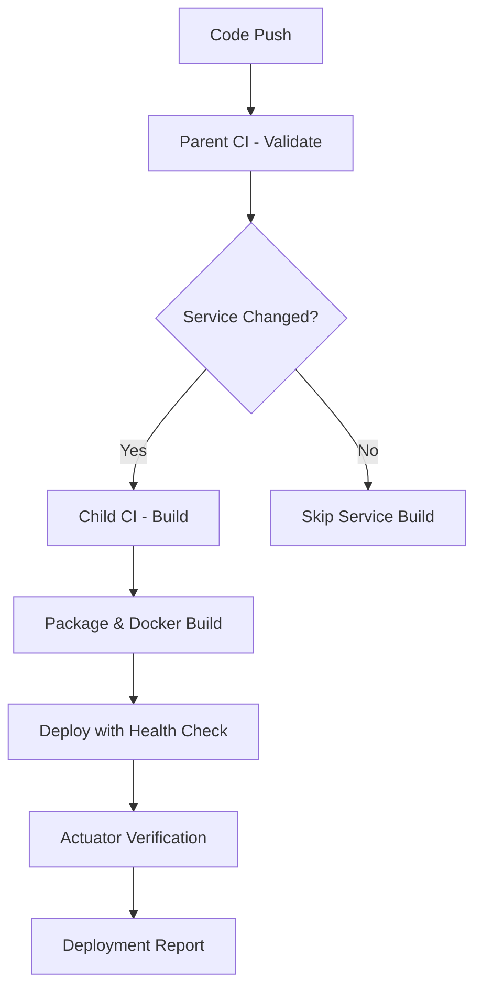

# Development Guide

This document provides detailed technical information for developing and running the microservices project.

## 🛠️ Implementation Journey

### Step 1: Initial Assessment
- **Challenge**: Monolithic CI/CD configuration in root `.gitlab-ci.yml`
- **Problem**: All services built together, inefficient resource usage
- **Goal**: Create scalable parent-child CI/CD architecture

### Step 2: Architecture Decision
- **Question**: Should we move CI files inside individual microservices?
- **Decision**: Keep parent-child relationship for better orchestration
- **Reasoning**: Centralized stage management while enabling service independence

### Step 3: Parent CI Simplification
```yaml
# BEFORE: Complex parent with hardcoded service logic
package:
  script:
    - mvn package -DskipTests
    - docker build -t analytics-service:$CI_COMMIT_SHA ./analytics-service

# AFTER: Minimal parent focused on common concerns
validate:
  script:
    - mvn validate
```

### Step 4: Child CI Creation
- **Created**: `analytics-service/.analytics-service-gitlab-ci.yml`
- **Pattern**: `.service-name-gitlab-ci.yml` naming convention
- **Benefit**: Clear identification and no naming conflicts

### Step 5: Selective Building Implementation
```yaml
# Added change detection for efficiency
rules:
  - changes:
      - "analytics-service/**/*"
```

### Step 6: Generic Job Names
```yaml
# BEFORE: Service-specific names
build_analytics:
package_analytics:
deploy_analytics:

# AFTER: Generic, reusable names
build:
package:
deploy:
```

### Step 7: Spring Actuator Integration
- **Added**: Health monitoring endpoints
- **Configured**: `application.properties` with actuator settings
- **Enabled**: CI/CD health verification

### Step 8: Real Deployment Logic
```yaml
# Enhanced deployment with actual health checks
script:
  - docker-compose up -d $SERVICE_NAME
  - docker exec $CONTAINER_ID curl -f http://localhost:$SERVICE_PORT/actuator/health
```

### Step 9: Documentation & Best Practices
- **Updated**: `DEVELOPMENT.md` with comprehensive guide
- **Documented**: Step-by-step process for adding new services
- **Established**: Consistent patterns and naming conventions

## 🎯 Skeleton Structure Achievements

### ✅ CI/CD Architecture Implemented
We have successfully implemented a **parent-child CI/CD architecture** for microservices:

#### Parent CI Configuration (`.gitlab-ci.yml`)
- 🏗️ **Common stages**: `validate` → `build` → `package` → `test` → `deploy`
- 🔧 **Global setup**: Maven image, cache, and shared variables
- 📋 **Project validation**: Ensures POM structure integrity
- 📦 **Dependency monitoring**: Watches for shared dependency changes
- 📂 **Child inclusion**: Dynamically includes service-specific CI files

#### Child CI Configuration (`.analytics-service-gitlab-ci.yml`)
- 🎯 **Service-specific builds**: Only builds when service files change
- 🚀 **Independent deployment**: Each service manages its own lifecycle
- 📊 **Health monitoring**: Spring Actuator integration for deployment verification
- 🐳 **Docker integration**: Containerized deployment with health checks

### 🔄 Selective Building Strategy
```yaml
# Only runs when analytics-service files change
rules:
  - changes:
      - "analytics-service/**/*"
```

### 📊 Health Monitoring Integration
- **Spring Actuator** endpoints configured
- **Health checks** in CI/CD pipeline
- **Deployment verification** with detailed reporting
- **GitLab console logging** for deployment status

### 🏗️ Project Structure
```
TFMS/
├── .gitlab-ci.yml                                    # Parent CI
├── docker-compose.yml                                # Service orchestration
├── pom.xml                                           # Parent POM
├── analytics-service/
│   ├── .analytics-service-gitlab-ci.yml              # Child CI
│   ├── Dockerfile                                    # Service containerization
│   ├── pom.xml                                       # Service dependencies
│   └── src/main/resources/
│       └── application.properties                    # Actuator config
├── auth-service/                                     # Ready for expansion
├── gateway-service/                                  # Ready for expansion
└── [other-services]/                                 # Scalable structure
```

## Architecture Overview

### CI/CD Flow


## Spring Boot Microservices Setup

### Parent POM Configuration
The parent `pom.xml` manages:
- Common dependencies
- Spring Boot/Cloud versions
- Java version and compiler settings
- Common plugins
- Module definitions

### Module Management
Each microservice module should:
1. Extend the parent POM
2. Define its own dependencies
3. Have its own Spring Boot application class
4. Include service-specific configurations

Example module `pom.xml`:
```xml
<?xml version="1.0" encoding="UTF-8"?>
<project xmlns="http://maven.apache.org/POM/4.0.0">
    <modelVersion>4.0.0</modelVersion>
    
    <parent>
        <groupId>your.group.id</groupId>
        <artifactId>parent-project</artifactId>
        <version>1.0.0-SNAPSHOT</version>
    </parent>
    
    <artifactId>service-name</artifactId>
    <name>Service Name</name>
    
    <dependencies>
        <!-- Service-specific dependencies -->
    </dependencies>
</project>
```

## Docker Configuration

### Docker Compose Setup
The `docker-compose.yml` file orchestrates all services:
```yaml
version: '3.8'
services:
  service1:
    build: ./service1
    ports:
      - "8081:8081"
    environment:
      - SPRING_PROFILES_ACTIVE=docker
    networks:
      - microservices-network

  service2:
    build: ./service2
    ports:
      - "8082:8082"
    environment:
      - SPRING_PROFILES_ACTIVE=docker
    networks:
      - microservices-network

networks:
  microservices-network:
    driver: bridge
```

### Dockerfile Template
Each service should have a Dockerfile:
```dockerfile
FROM openjdk:17-jdk-slim
WORKDIR /app
COPY target/*.jar app.jar
EXPOSE 8080
ENTRYPOINT ["java","-jar","app.jar"]
```

## Development Workflow

### Local Development Setup
1. Build all modules:
```bash
mvn clean install
```

2. Start all services:
```bash
docker-compose up --build
```

3. Start individual service:
```bash
docker-compose up service-name
```

### Spring Profiles
- `default`: Local development
- `docker`: Docker environment
- `test`: Testing environment

### Configuration Management
Each service should have environment-specific configurations:
```
src/main/resources/
├── application.yml
├── application-docker.yml
└── application-test.yml
```

## 🚀 Adding New Services (Skeleton Pattern)

### Step-by-Step Process
1. **Create service directory**: `mkdir new-service`
2. **Copy skeleton CI**: Copy `.analytics-service-gitlab-ci.yml` as template
3. **Update CI variables**:
   ```yaml
   variables:
     SERVICE_NAME: "new-service"
     SERVICE_PORT: "8091"  # Unique port
   ```
4. **Update parent CI include**:
   ```yaml
   include:
     - local: 'analytics-service/.analytics-service-gitlab-ci.yml'
     - local: 'new-service/.new-service-gitlab-ci.yml'  # Add this
   ```
5. **Add to parent POM modules**
6. **Create service POM file**
7. **Add Spring Actuator configuration**
8. **Create Dockerfile**
9. **Add to docker-compose.yml**

### Skeleton Benefits
- ✅ **Copy-paste ready**: Consistent CI structure
- ✅ **Selective building**: Only builds changed services
- ✅ **Independent deployment**: Each service manages itself
- ✅ **Health monitoring**: Built-in actuator integration
- ✅ **Scalable**: Easy to add unlimited services

## 📊 Monitoring & Health Checks

### Spring Actuator Integration
Each service includes comprehensive monitoring:

```properties
# Actuator endpoints enabled
management.endpoints.web.exposure.include=health,info,metrics
management.endpoint.health.show-details=always

# Service information
info.app.name=Analytics Service
info.app.version=1.0.0
```

### Available Endpoints
- **Health**: `/actuator/health` - Service health status
- **Info**: `/actuator/info` - Application metadata
- **Metrics**: `/actuator/metrics` - Performance metrics

### CI/CD Health Verification
```bash
# Automated health checks in deployment
docker exec $CONTAINER_ID curl -f http://localhost:$SERVICE_PORT/actuator/health
```

## 📋 Best Practices Implemented

### ✅ CI/CD Best Practices
- **Parent-child separation**: Clean architectural boundaries
- **Selective building**: Efficient resource utilization
- **Health verification**: Automated deployment validation
- **Consistent naming**: `.service-name-gitlab-ci.yml` pattern
- **Modern GitLab syntax**: Using `rules` instead of deprecated `only`

### ✅ Service Independence
- **Individual CI files**: Each service manages its own pipeline
- **Change detection**: Services build only when modified
- **Independent deployment**: Manual triggers per service
- **Containerized isolation**: Docker-based deployment

### ✅ Configuration Management
- **Actuator integration**: Built-in health monitoring
- **Environment-specific configs**: Properties-based configuration
- **Service metadata**: Comprehensive info endpoints
- **Port management**: Unique ports per service

### ✅ Monitoring and Health Checks
- **Spring Actuator**: Comprehensive health endpoints
- **GitLab reporting**: Detailed deployment logs in CI console
- **Container verification**: Docker-based health checks
- **Automated validation**: CI pipeline health verification

### 🔮 Future Enhancements
- Service mesh integration (Istio/Linkerd)
- Distributed tracing (Jaeger/Zipkin)
- Centralized logging (ELK Stack)
- API Gateway integration
- Service discovery (Eureka/Consul)
- Circuit breaker patterns (Hystrix/Resilience4j)

## 📚 Key Decisions & Rationale

### Why Parent-Child CI Architecture?
1. **Scalability**: Easy to add new services without modifying existing ones
2. **Efficiency**: Only builds services that actually changed
3. **Maintainability**: Clear separation between global and service-specific logic
4. **Consistency**: Standardized approach across all services

### Why Docker Compose over nohup?
1. **Isolation**: Each service runs in its own container
2. **Port Management**: Automatic port mapping and conflict resolution
3. **Health Monitoring**: Built-in health check capabilities
4. **Service Discovery**: Services can communicate by name
5. **Professional Standard**: Industry best practice for microservices

### Why Spring Actuator Integration?
1. **Health Verification**: Automated deployment validation in CI/CD
2. **Monitoring**: Built-in metrics and health endpoints
3. **Debugging**: Easy troubleshooting through actuator endpoints
4. **GitLab Reporting**: Detailed deployment status in CI console

### Why Generic Job Names?
1. **Template Reusability**: Same structure works for all services
2. **Clean Pipeline View**: Consistent naming across services
3. **Copy-Paste Friendly**: Easy to replicate for new services
4. **Standard Convention**: Follows CI/CD best practices

## 🎓 Lessons Learned

### What Worked Well
- ✅ **Incremental approach**: Building step by step prevented complexity
- ✅ **Testing each change**: Validating each modification before proceeding
- ✅ **Documentation**: Recording decisions and rationale
- ✅ **Naming conventions**: Consistent patterns improved maintainability

### Challenges Overcome
- 🔧 **GitLab syntax evolution**: Migrated from `only` to `rules`
- 🔧 **Health check complexity**: Solved localhost unavailability in CI
- 🔧 **File naming**: Established clear naming patterns
- 🔧 **Change detection**: Implemented efficient selective building

### Best Practices Established
- 📋 **Parent stays minimal**: Only common concerns in parent CI
- 📋 **Children are independent**: Each service manages its lifecycle
- 📋 **Health monitoring**: Always verify deployment success
- 📋 **Documentation first**: Document decisions and patterns

## Troubleshooting

### Common Issues
1. Port conflicts
   - Solution: Check docker-compose port mappings
   
2. Service discovery issues
   - Solution: Verify network settings in docker-compose

3. Build failures
   - Solution: Check parent POM and module dependencies

### Docker Commands
```bash
# View logs
docker-compose logs service-name

# Rebuild specific service
docker-compose up --build service-name

# Remove all containers and volumes
docker-compose down -v
```
